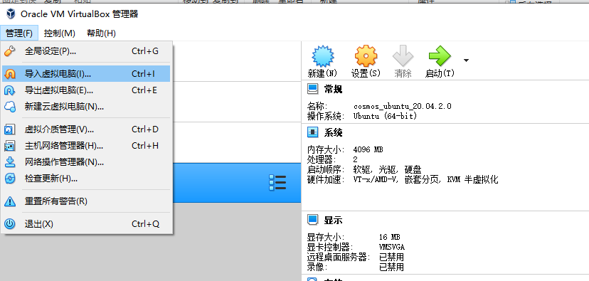
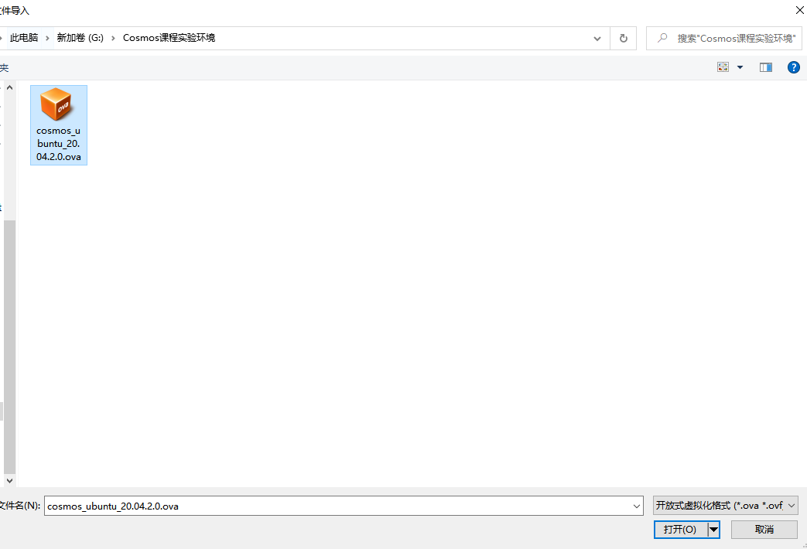
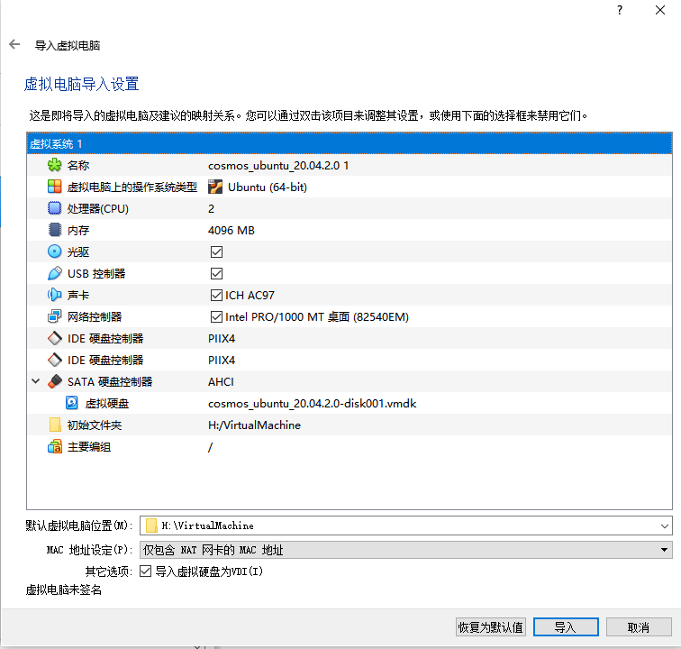
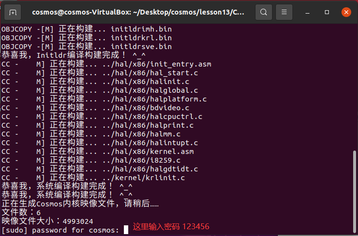
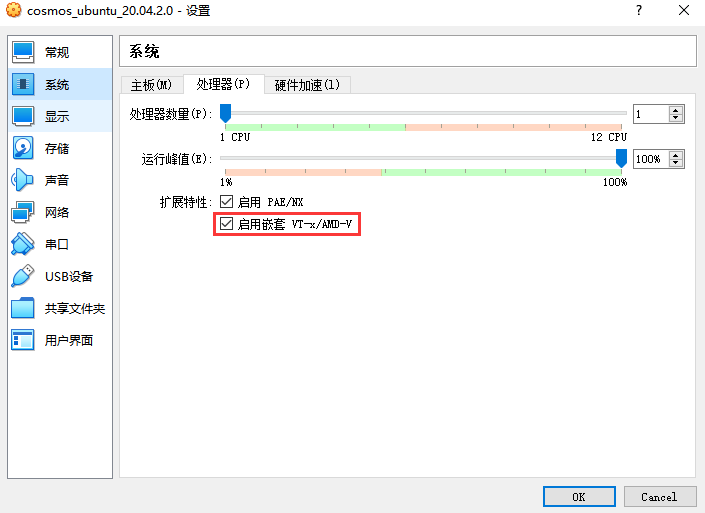

# Cosmos课程实验环境

## 虚拟电脑下载地址

百度网盘：https://pan.baidu.com/s/1FO65O5CR9KU73UmzDV6dBQ 
提取码：aq6q 

## 使用方法

1. 下载并安装VirtualBox-6.1

2. 使用VirtualBox导入虚拟机

   2.1 打开虚拟机管理器，选择菜单：管理->导入虚拟电脑

   

   2.2 选择文件"cosmos_ubuntu_20.04.2.0.ova"

   

   2.3 导入时可以根据自己的机器配置进行一些修改：例如**处理器、内存、文件夹位置**等
   
   
   
3. 运行虚拟机
   
   3.1 **用户名：cosmos，密码：123456，root用户密码：123456**
   
   3.2 桌面上有文件夹cosmos，对应git地址：https://gitee.com/lmos/cosmos.git

   3.3 运行测试
   
   ```bash
   cd ~/Desktop/cosmos/lesson13/Cosmos
   # 注意, 执行下面的make命令后有个需要输入密码的地方，输入密码：123456 即可
   make vboxtest
   ```
   



## Ubuntu中安装的工具

git、gcc、vim、nasm、make、VSCode、virtualBox-6.1

## 注意事项

1. 最外层宿主机安装的virtualBox，需要设置CPU支持嵌套虚拟化

   

2. Ubuntu的virtualBox中，新建了一个虚拟机Cosmos，在课程中执行```make vboxtest```会自动把硬盘加载进去并启动虚拟机。

3. 执行```make vboxtest```时，前面不要加```sudo```，会由于用户组不同，导致无法找到virtualBox中建立的虚拟机Cosmos。

